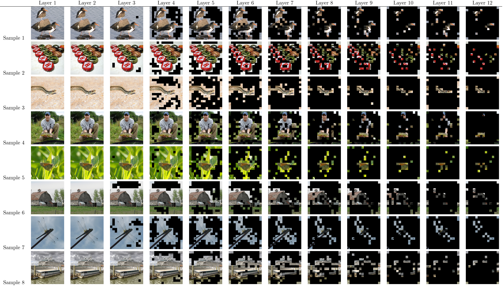

# Soft-Masked Selective Vision Transformer

Code for the paper ["Efficient vision transformers via patch selective soft-masked attention and knowledge distillation"](https://doi.org/10.1016/j.asoc.2026.115151) published in *Applied Soft Computing*.

Soft-Masked Selective Vision Transformer (SM-Selective ViT) is an efficient Vision Transformer architecture that reduces the cost of self-attention by learning to focus on the most informative image patches while suppressing less useful ones. The method combines **patch-selective soft-masked attention** with **knowledge distillation** to improve the efficiency–accuracy trade-off, making it suitable for both research and deployment in resource-constrained settings.

---

## Method Overview

The core idea is to learn a **soft patch-selection mechanism** inside the transformer block so that attention emphasizes salient image regions and reduces the contribution of less informative patches.



---

## Repository Purpose

This repository contains the code used for the experiments reported in the paper, including:

* training from scratch
* knowledge distillation training
* fine-tuning at higher input resolution
* evaluation and inference with released checkpoints

---

## Available Models

### Hugging Face Checkpoints

* `XAFT/SM-Selective-ViT-Tiny-448`
* `XAFT/SM-Selective-ViT-Tiny-224`
* `XAFT/SM-Selective-ViT-Small-224-Distilled`
* `XAFT/SM-Selective-ViT-Small-224`
* `XAFT/SM-Selective-ViT-Tiny-Tall-224-Distilled`
* `XAFT/SM-Selective-ViT-Tiny-Tall-224`
* `XAFT/SM-Selective-ViT-Base-224`
* `XAFT/SM-Selective-ViT-Base-224-Distilled`
* `XAFT/SM-Selective-ViT-Tiny-224-Distilled`

---

## Reported Results

| Model | Training config | Top-1 Acc. | Top-5 Acc. | # Params | Avg. GFLOPs |
|------|------|------:|------:|------:|------:|
| [Base][hf-base] | [`config/scratch/sparsevit_base_maskloss.yml`][cfg-base] | 80.350% | 94.980% | 86.60M | 9.61 |
| [Base (distilled)][hf-base-dist] | [`config/distil/regnet_y_16gf/sparsevit_base_maskloss_hard.yml`][cfg-base-dist] | 80.990% | 95.386% | 87.37M | 9.21 |
| [Small][hf-small] | [`config/scratch/sparsevit_small_maskloss.yml`][cfg-small] | 78.662% | 94.454% | 22.06M | 3.12 |
| [Small (distilled)][hf-small-dist] | [`config/distil/regnet_y_16gf/sparsevit_small_maskloss_hard.yml`][cfg-small-dist] | 79.000% | 94.494% | 22.45M | 3.05 |
| [Tiny tall][hf-tinytall] | [`config/scratch/sparsevit_tiny_tall_maskloss.yml`][cfg-tinytall] | 74.802% | 92.794% | 11.07M | 1.64 |
| [Tiny tall (distilled)][hf-tinytall-dist] | [`config/distil/regnet_y_16gf/sparsevit_tiny_tall_maskloss_hard.yml`][cfg-tinytall-dist] | 75.676% | 92.988% | 11.26M | 1.64 |
| [Tiny][hf-tiny] | [`config/scratch/sparsevit_tiny_maskloss.yml`][cfg-tiny] | 71.056% | 90.192% | 5.72M | 0.95 |
| [Tiny (distilled)][hf-tiny-dist] | [`config/distil/regnet_y_16gf/sparsevit_tiny_maskloss_hard.yml`][cfg-tiny-dist] | 72.618% | 91.338% | 5.92M | 0.93 |
| [Tiny (finetuned @ 448×448)][hf-tiny-448] | [`config/ft_448/sparsevit_tiny_maskloss.yml`][cfg-tiny-448] | 76.742% | 93.704% | 5.84M | 4.83 |

[hf-base]: https://huggingface.co/XAFT/SM-Selective-ViT-Base-224
[hf-base-dist]: https://huggingface.co/XAFT/SM-Selective-ViT-Base-224-Distilled
[hf-small]: https://huggingface.co/XAFT/SM-Selective-ViT-Small-224
[hf-small-dist]: https://huggingface.co/XAFT/SM-Selective-ViT-Small-224-Distilled
[hf-tinytall]: https://huggingface.co/XAFT/SM-Selective-ViT-Tiny-Tall-224
[hf-tinytall-dist]: https://huggingface.co/XAFT/SM-Selective-ViT-Tiny-Tall-224-Distilled
[hf-tiny]: https://huggingface.co/XAFT/SM-Selective-ViT-Tiny-224
[hf-tiny-dist]: https://huggingface.co/XAFT/SM-Selective-ViT-Tiny-224-Distilled
[hf-tiny-448]: https://huggingface.co/XAFT/SM-Selective-ViT-Tiny-448

[cfg-base]: ./config/scratch/sparsevit_base_maskloss.yml
[cfg-base-dist]: ./config/distil/regnet_y_16gf/sparsevit_base_maskloss_hard.yml
[cfg-small]: ./config/scratch/sparsevit_small_maskloss.yml
[cfg-small-dist]: ./config/distil/regnet_y_16gf/sparsevit_small_maskloss_hard.yml
[cfg-tinytall]: ./config/scratch/sparsevit_tiny_tall_maskloss.yml
[cfg-tinytall-dist]: ./config/distil/regnet_y_16gf/sparsevit_tiny_tall_maskloss_hard.yml
[cfg-tiny]: ./config/scratch/sparsevit_tiny_maskloss.yml
[cfg-tiny-dist]: ./config/distil/regnet_y_16gf/sparsevit_tiny_maskloss_hard.yml
[cfg-tiny-448]: ./config/ft_448/sparsevit_tiny_maskloss.yml

---

## Installation

Clone the repository and install the project dependencies.

```bash
git clone https://github.com/aftoul/sm_selective_transformer
cd sm_selective_transformer
pip install -r requirements.txt
```

If you are using TPUs, make sure your environment is configured accordingly before launching `tpu_train.py`.

---

## Dataset

The reported experiments were conducted on **ILSVRC 2012 / ImageNet-1K**.

The training script expects separate training and validation directories:

```text
/path/to/imagenet/
├── train/
│   ├── n01440764/
│   ├── n01443537/
│   └── ...
└── val/
    ├── n01440764/
    ├── n01443537/
    └── ...
```

---

## Training

The main training entry point is:

```bash
python tpu_train.py --config <config.yml> --train_data <train_dir> --val_data <val_dir> [--fine_tune <checkpoint>]
```

### Training Arguments

* `--config`: path to the YAML configuration file
* `--train_data`: path to the training dataset folder
* `--val_data`: path to the validation dataset folder
* `--fine_tune`: optional checkpoint path used for fine-tuning

### Configurations Used in the Paper

#### Training from scratch

* `config/scratch/sparsevit_base_maskloss.yml`
* `config/scratch/sparsevit_small_maskloss.yml`
* `config/scratch/sparsevit_tiny_maskloss.yml`
* `config/scratch/sparsevit_tiny_tall_maskloss.yml`

#### Distillation training

* `config/distil/regnet_y_16gf/sparsevit_base_maskloss_hard.yml`
* `config/distil/regnet_y_16gf/sparsevit_small_maskloss_hard.yml`
* `config/distil/regnet_y_16gf/sparsevit_tiny_maskloss_hard.yml`
* `config/distil/regnet_y_16gf/sparsevit_tiny_tall_maskloss_hard.yml`

#### Fine-tuning at 448×448

* `config/ft_448/sparsevit_tiny_maskloss.yml`

---

## Training Examples

### 1. Train a tiny model from scratch

```bash
python tpu_train.py \
  --config config/scratch/sparsevit_tiny_maskloss.yml \
  --train_data /path/to/imagenet/train \
  --val_data /path/to/imagenet/val
```

### 2. Train a small distilled model

```bash
python tpu_train.py \
  --config config/distil/regnet_y_16gf/sparsevit_small_maskloss_hard.yml \
  --train_data /path/to/imagenet/train \
  --val_data /path/to/imagenet/val
```

### 3. Fine-tune the tiny model at 448×448

```bash
python tpu_train.py \
  --config config/ft_448/sparsevit_tiny_maskloss.yml \
  --train_data /path/to/imagenet/train \
  --val_data /path/to/imagenet/val \
  --fine_tune /path/to/checkpoint.pth
```

---

## Usage

### Hugging Face Inference Example

```python
import torch
from transformers import AutoModelForImageClassification, AutoImageProcessor
from PIL import Image
import requests

# Load image
url = "http://images.cocodataset.org/val2017/000000039769.jpg"
image = Image.open(requests.get(url, stream=True).raw).convert("RGB")

# Load processor and model
processor = AutoImageProcessor.from_pretrained(
    "XAFT/SM-Selective-ViT-Tiny-448",
    trust_remote_code=True,
)

model = AutoModelForImageClassification.from_pretrained(
    "XAFT/SM-Selective-ViT-Tiny-448",
    trust_remote_code=True,
)

# Optional: use half precision when supported
model = model.half().eval()

# Preprocess
inputs = processor(images=image, return_tensors="pt")
inputs = {k: v.to(torch.float16) if v.dtype.is_floating_point else v for k, v in inputs.items()}

# Forward pass
with torch.no_grad():
    outputs = model(**inputs)

logits = outputs.logits
predicted_class = logits.argmax(-1).item()
print("Predicted class index:", predicted_class)
```

## Method Summary

SM-Selective ViT modifies the standard Vision Transformer pipeline by introducing a soft-masking mechanism over patch tokens. Rather than treating all patches equally, the model learns which regions deserve stronger attention. This improves efficiency by reducing unnecessary attention computation while preserving discriminative information. In addition, knowledge distillation further improves the performance of lightweight variants by transferring information from a stronger teacher model.

---

## Acknowledgments

We thank the **TPU Research Cloud** program for providing cloud TPUs used to build and train the models for our experiments.

---

## Citation

If you use this repository or the published work, please cite:

```bibtex
@article{TOULAOUI2026115151,
    title = {Efficient vision transformers via patch selective soft-masked attention and knowledge distillation},
    journal = {Applied Soft Computing},
    pages = {115151},
    year = {2026},
    issn = {1568-4946},
    doi = {https://doi.org/10.1016/j.asoc.2026.115151},
    url = {https://www.sciencedirect.com/science/article/pii/S1568494626005995},
    author = {Abdelfattah Toulaoui and Hamza Khalfi and Imad Hafidi},
    keywords = {Vision transformer, Patch selection, Soft masking, Efficient inference}
}
```

---

## License

This repository is released under the MIT license as found in the [LICENSE](LICENSE) file.
